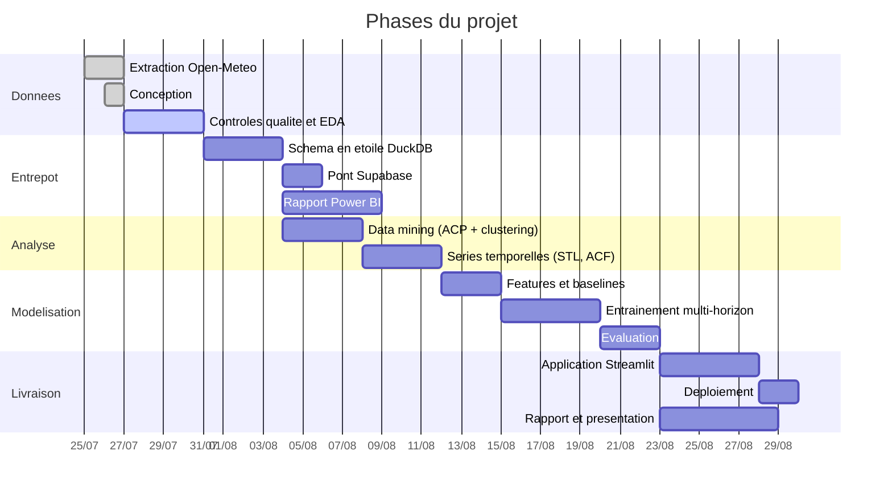

# 3 — Planning

> **Auteur** : Ahmed Ben Arfa
> **Projet** : Tunisia Weather Prediction
> **Date** : juillet 2026

Découpage en cinq phases. Les durées sont indicatives et supposent un travail à
temps partagé.

## Vue d'ensemble

## Phase 1 — Données

**Terminé.** Extraction des 24 gouvernorats depuis Open-Meteo, sur deux jours
en raison du quota journalier. Vérification de l'intégrité : 1 585 728 lignes,
aucune valeur manquante, aucun doublon, continuité horaire parfaite.

Conception du projet rédigée et validée.

**Phase terminée.** Contrôles automatisés (16 tests), correction des humidités
de sol négatives, mesure du décalage ERA5/forecast sur les 24 gouvernorats, et
notebook d'analyse exploratoire exécuté.

| Jalon | Critère de sortie | État |
|---|---|---|
| Jeu de données validé | Contrôles automatisés passants | Fait |
| Anomalies corrigées | `tunisia_weather_clean.parquet` écrit | Fait |
| Décalage train/prod quantifié | Tableau sur les 24 gouvernorats | Fait — 17 variables retenues sur 31 |
| EDA livrée | Notebook exécuté, contrastes régionaux caractérisés | Fait |

## Phase 2 — Entrepôt et restitution descriptive

Construction du schéma en étoile dans DuckDB, agrégat journalier, pont vers
Supabase, puis rapport Power BI.

| Jalon | Critère de sortie |
|---|---|
| Schéma en étoile chargé | Volumétries conformes, requêtes de contrôle passantes |
| Supabase alimenté | Dimension et fait journalier en ligne, sous 500 Mo |
| Rapport Power BI | Pages climatologie, extrêmes, précipitations |

## Phase 3 — Les deux analyses

Deux phases distinctes, toutes deux placées **avant** la modélisation parce que
chacune produit quelque chose que les modèles consomment.

### 3a — Data mining (dimension spatiale)

ACP sur les profils climatiques agrégés, K-means, validation géographique des
groupes obtenus.

| Jalon | Critère de sortie |
|---|---|
| Groupes climatiques établis | Nombre justifié par coude et silhouette |
| Cohérence géographique vérifiée | Les groupes correspondent à des réalités connues |
| `dim_gouvernorat` enrichie | Colonne `cluster_climatique` chargée |

### 3b — Séries temporelles (dimension temporelle)

Décomposition STL, stationnarité, ACF/PACF, puis les trois modèles statistiques.

| Jalon | Critère de sortie |
|---|---|
| Décomposition livrée | Cycles diurne et annuel isolés |
| Stationnarité testée | ADF et KPSS convergents |
| **Décalages justifiés** | Choix des lags appuyé sur la PACF, pas sur l'intuition |
| Modèles statistiques ajustés | ARIMA, SARIMA, Fourier+ARIMA, MAE aux trois horizons |

## Phase 4 — Modélisation

Construction des variables, baselines, entraînement, comparaison, sélection.

Ordre imposé : **les baselines d'abord**. Sans elles, aucun score de modèle
n'est interprétable.

| Jalon | Critère de sortie |
|---|---|
| `build_features()` figée | Fonction unique, testée, sans fuite temporelle |
| Baselines mesurées | MAE de persistance et de climatologie aux trois horizons |
| Modèles entraînés | Linéaire, Ridge, Lasso, arbre, forêt, XGBoost × 3 horizons |
| Comparaison témoin | k-NN et XGBoost témoin sur ~50 000 lignes, à armes égales |
| Tableau comparatif | Baselines, modèles statistiques et ML réunis |
| Modèle retenu | Sélection sur la MAE, interprétation SHAP, sérialisation |

## Phase 5 — Livraison

Application Streamlit, déploiement, rapport et présentation.

| Jalon | Critère de sortie |
|---|---|
| Application fonctionnelle en local | Prévision de bout en bout depuis l'API forecast |
| Déploiement | URL publique accessible, secrets configurés |
| Rapport | PDF complet, limites incluses |
| Présentation | Slides et démonstration prêtes |

## Points de vigilance sur le calendrier

- **L'extraction ne se rejoue pas à la légère.** Une ré-extraction complète
  coûte deux jours à cause du quota. Les données étant versionnées, elle ne
  devrait pas être nécessaire.
- **Le décalage train/prod se mesure tôt.** Il conditionne le choix des
  variables, donc toute la phase de modélisation. Le repousser ferait
  retravailler les features après coup.
- **Les baselines avant les modèles.** Entraîner d'abord et comparer ensuite
  conduit presque toujours à surestimer l'apport du modèle.
- **La PACF avant le feature engineering.** Choisir les décalages puis chercher
  à les justifier après coup inverse la démarche : l'analyse temporelle doit
  précéder, sinon elle ne sert qu'à habiller une décision déjà prise.
- **L'application dépend de `build_features()`.** Toute modification tardive de
  cette fonction impose de réentraîner les trois modèles.
