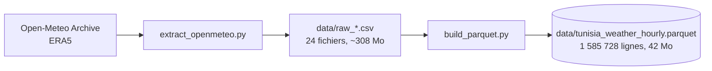

# 01 — ETL

Extraction des données horaires Open-Meteo pour les 24 gouvernorats, conversion
en Parquet compressé, contrôles qualité et analyse exploratoire.

## Flux de données



## Fichiers

| Fichier | Rôle | État |
|---|---|---|
| `extract_openmeteo.py` | Extraction ERA5, gestion du quota, reprise sur incident | Terminé |
| `build_parquet.py` | Concaténation des 24 CSV en un Parquet zstd | Terminé |
| `checks.py` | Contrôles qualité (complétude, plages physiques, continuité horaire) | À venir |
| `skew_analysis.py` | Comparaison ERA5 / API forecast sur les 24 gouvernorats | À venir |
| `notebooks/01_eda.ipynb` | Analyse exploratoire | À venir |

## Exécution

```bash
# Extraction complete depuis Open-Meteo (plusieurs heures, voir plus bas)
python 01_etl/extract_openmeteo.py

# Reconstruction du Parquet a partir des CSV
python 01_etl/build_parquet.py
```

Les données livrées avec le dépôt rendent ces deux étapes facultatives.

## La contrainte de quota, et comment le script la gère

Le quota Open-Meteo n'est pas un compte de requêtes mais un **volume pondéré** :

```
poids = (nb_variables / 10) x (nb_jours / 14)
```

Une requête ici — 31 variables sur 7,5 ans — pèse donc à elle seule ~610
appels. Les 24 gouvernorats totalisent ~14 600 appels pour un plafond gratuit
de 10 000 par jour : **l'extraction complète ne tient pas dans une journée.**

Trois plafonds se superposent : 600 appels par minute, 5 000 par heure, 10 000
par jour. Le script lit le motif exact renvoyé dans la réponse 429 et réagit en
conséquence :

| Motif renvoyé | Réaction |
|---|---|
| `Minutely ... limit exceeded` | attente de 65 s |
| `Hourly ... limit exceeded` | attente jusqu'à l'heure pleine suivante |
| `Daily ... limit exceeded` | arrêt propre, liste des gouvernorats restants |

Un backoff exponentiel classique ne suffit pas : il retente avant la
réouverture de la fenêtre et épuise ses essais dans le vide.

Le script **reprend là où il s'est arrêté** — tout gouvernorat dont le CSV
existe déjà est relu depuis le disque au lieu d'être retéléchargé. Relancer la
même commande le lendemain suffit à terminer.

Le **quota journalier se réinitialise à minuit UTC**, ce que la documentation
Open-Meteo ne précise pas ; le comportement a été vérifié empiriquement.

## Décisions de conception

- **Chef-lieu comme point de mesure.** Chaque gouvernorat est représenté par
  les coordonnées de son chef-lieu. Les gouvernorats étendus du sud ont une
  variabilité interne que ce point unique ne capture pas.
- **Fuseau `Africa/Tunis`** demandé à l'API, pour que les heures soient
  directement interprétables sans conversion.
- **Fin de série au 2026-07-15.** ERA5 accuse environ cinq jours de retard sur
  le temps réel.
- **Parquet plutôt que CSV** pour le versionnement : 42 Mo contre 308 Mo, et
  DuckDB le lit sans import préalable.

## Sortie

`data/tunisia_weather_hourly.parquet` — 1 585 728 lignes × 36 colonnes,
2019-01-01 → 2026-07-15, sans valeur manquante ni doublon.
