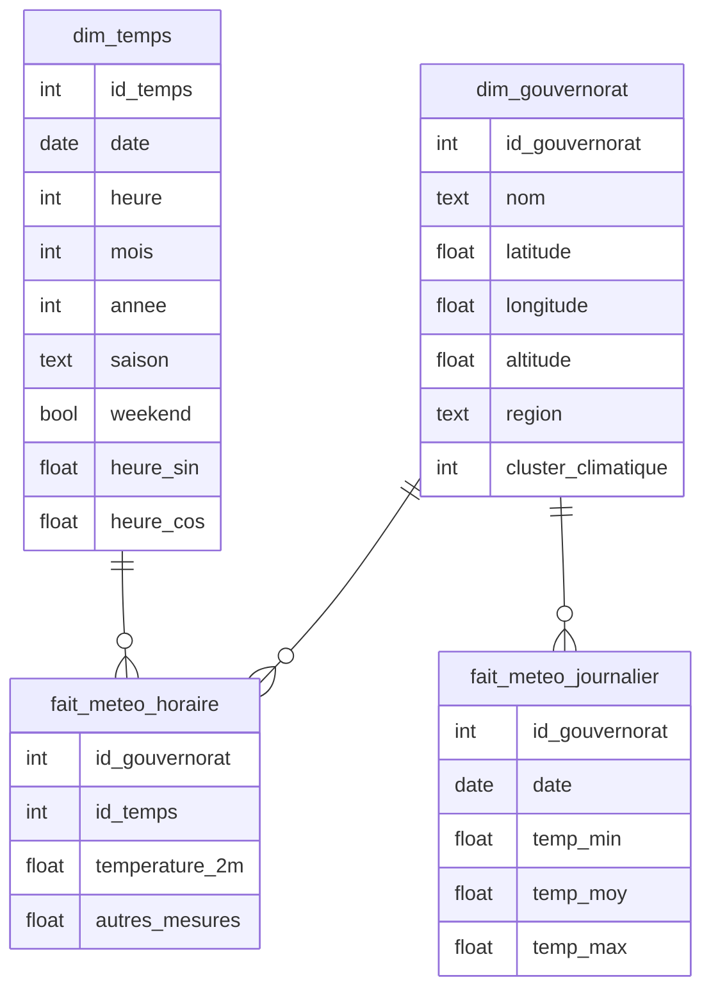

# 02 — Entrepôt de données

Schéma en étoile construit dans DuckDB à partir du Parquet horaire, plus le
pont vers Supabase pour la partie déployée.

**État : à venir.**

## Modèle dimensionnel

| Table | Grain | Lignes |
|---|---|---|
| `dim_gouvernorat` | Un gouvernorat | 24 |
| `dim_temps` | Une heure | 66 072 |
| `fait_meteo_horaire` | Gouvernorat × heure | 1 585 728 |
| `fait_meteo_journalier` | Gouvernorat × jour | 66 072 |

## Ce qui part vers Supabase, et ce qui reste

Le palier gratuit Supabase plafonne à 500 Mo. Ne sont poussés que
`dim_gouvernorat`, `fait_meteo_journalier` et la table de journalisation des
prédictions. **Le fait horaire reste en local**, où DuckDB le traite sans
difficulté.

C'est aussi un choix de performance : l'application n'a jamais besoin de
l'historique horaire complet, elle interroge Open-Meteo pour les entrées
fraîches du modèle.

## Fichiers prévus

| Fichier | Rôle |
|---|---|
| `create_star_schema.sql` | DDL des tables du schéma en étoile |
| `build_star_schema.py` | Chargement depuis le Parquet vers DuckDB |
| `export_to_supabase.py` | Pont DuckDB → Postgres (`INSTALL postgres; ATTACH`) |
| `explore_warehouse.py` | Requêtes de contrôle et de volumétrie |
