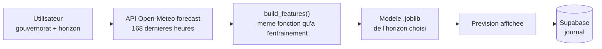

# 06 — Application web

Application Streamlit exposant les modèles de prévision, déployée sur Streamlit
Cloud avec journalisation des prédictions dans Supabase.

**État : à venir.**

## Enchaînement d'une prédiction

## Le point critique : une seule fonction de features

`build_features()` est importée depuis `06_machine_learning/features.py`. Elle
n'est **jamais réécrite ici**. Mêmes colonnes, mêmes noms, même ordre qu'à
l'entraînement — c'est ce qui garantit qu'un modèle performant en validation le
reste en production.

## Pages prévues

| Page | Contenu |
|---|---|
| Prévision | Choix du gouvernorat et de l'horizon, résultat, intervalle d'erreur attendu |
| Comparaison | Écart entre la prévision du modèle et celle publiée par Open-Meteo |
| Exploration | Climatologie du gouvernorat, alimentée par l'agrégat journalier Supabase |
| Historique | Prédictions passées journalisées, et leur écart au réalisé |

La page de comparaison est volontairement mise en avant : elle situe le modèle
face à un système opérationnel professionnel, sans prétendre le dépasser.

## Modèles et déploiement

Les fichiers `.joblib` servis par l'application **sont versionnés** dans
`07_web_app/models/` — Streamlit Cloud déploie depuis le dépôt et n'aurait
sinon rien à charger. Les modèles côté entraînement, eux, restent ignorés par
Git puisqu'ils se régénèrent.

## Secrets

La chaîne de connexion Supabase est lue depuis `.env`, jamais inscrite en dur.
`.env` figure dans `.gitignore` ; `.env.example` documente les variables
attendues. Sur Streamlit Cloud, ces valeurs passent par les *secrets* de la
plateforme.
