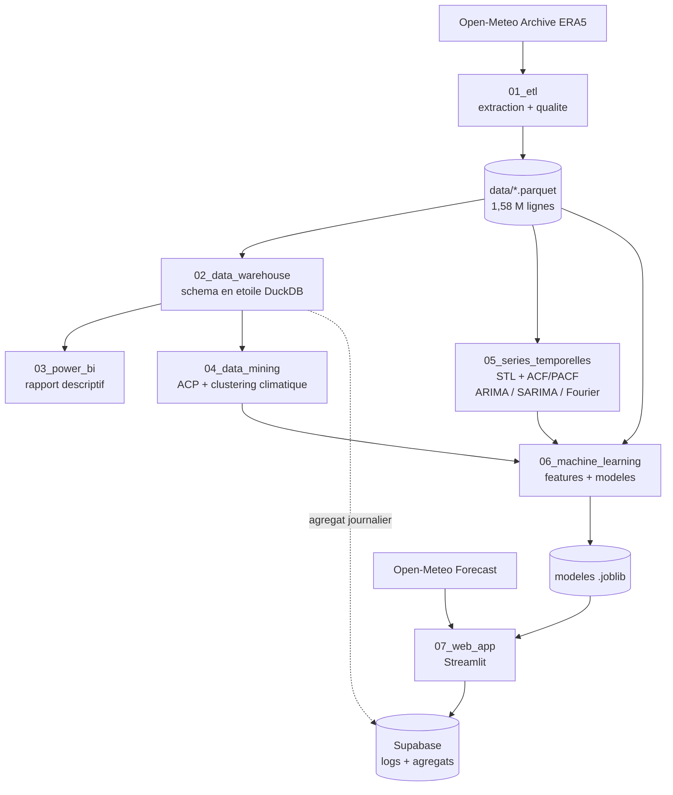

# Tunisia Weather Prediction — Prévision de température par gouvernorat

> **Auteur** : Ahmed Ben Arfa

Chaîne analytique complète, de l'extraction des données à une application web
déployée, appliquée à la **prévision de température à court terme** pour les
24 gouvernorats tunisiens.

Le modèle prédit la température à **t+1 h, t+24 h et t+72 h** à partir de
l'état météorologique observé jusqu'à l'instant courant.

## Sommaire

- [Le problème](#le-problème)
- [Données](#données)
- [Architecture](#architecture)
- [Structure du dépôt](#structure-du-dépôt)
- [Installation](#installation)
- [Reproduire le pipeline](#reproduire-le-pipeline)
- [Choix méthodologiques](#choix-méthodologiques)
- [État d'avancement](#état-davancement)

## Le problème

Prévoir une température, c'est une **régression sur série temporelle** — pas
une classification. Cette différence gouverne toute la démarche :

- le découpage train/test est **chronologique**, jamais aléatoire ;
- une variable n'est utilisable que si elle est **connue à l'instant de la
  prédiction** ;
- le modèle doit être comparé à des **baselines météorologiques**, pas à un
  tirage au hasard.

Un modèle de température qui affiche un R² de 0,99 est presque toujours un
modèle qui triche. La section [Choix méthodologiques](#choix-méthodologiques)
détaille comment ce piège est évité ici.

## Données

**Source** : [Open-Meteo](https://open-meteo.com) — gratuit, sans clé d'API,
sous licence libre.

| Usage | Point d'entrée | Rôle |
|---|---|---|
| Entraînement | `archive-api.open-meteo.com` (réanalyse ERA5) | Historique 2019-01-01 → 2026-07-15 |
| Production | `api.open-meteo.com/v1/forecast` | Observations des 168 dernières heures |

**Volume** : 24 gouvernorats × 66 072 heures = **1 585 728 lignes**, 36 colonnes
(31 variables météorologiques + gouvernorat, horodatage, latitude, longitude,
altitude). Aucune valeur manquante, aucun doublon.

Les données sont **versionnées avec le dépôt** au format Parquet compressé
(`data/tunisia_weather_hourly.parquet`, 42 Mo) — elles sont publiques, donc
rien n'impose de les cacher. Les CSV bruts (~308 Mo) sont ignorés par Git :
redondants, et au-delà de la limite GitHub de 100 Mo par fichier.

## Architecture



Le partage local / en ligne est délibéré :

| Étape | Outil | Où |
|---|---|---|
| ETL, nettoyage, schéma en étoile, EDA | DuckDB | Local |
| Entraînement | Python + Parquet | Local |
| Application déployée + journal des prédictions | Supabase (Postgres) | En ligne |

DuckDB assume la charge lourde en local et lit le Parquet nativement. Seul le
produit fini et léger part vers Supabase, dont le palier gratuit plafonne à
500 Mo : dimension gouvernorat, fait journalier agrégé (66 072 lignes) et table
de journalisation. **Le fait horaire ne quitte jamais le poste local.**

## Structure du dépôt

| Dossier | Contenu |
|---|---|
| `00_documentation/` | Cadrage du projet, description des données, planning, guide technique |
| `01_etl/` | Extraction Open-Meteo, conversion Parquet, contrôles qualité, EDA |
| `02_data_warehouse/` | Schéma en étoile DuckDB, exports, pont Supabase |
| `03_power_bi/` | Rapport `.pbix`, mesures DAX, captures |
| `04_data_mining/` | ACP et clustering climatique des gouvernorats |
| `05_series_temporelles/` | STL, stationnarité, ACF/PACF, ARIMA / SARIMA / Fourier+ARIMA |
| `06_machine_learning/` | `features.py` partagé, entraînement multi-horizon, évaluation |
| `07_web_app/` | Application Streamlit et journalisation Supabase |
| `08_rapport/` | Documentation technique et rapport final (PDF) |
| `09_presentation/` | Slides |
| `data/` | Parquet versionné ; CSV bruts ignorés |
| `docs/conception/` | Documents de conception |

**Les deux phases d'analyse encadrent la modélisation et l'alimentent.** Le
data mining explore la dimension spatiale et produit `cluster_climatique` ; les
séries temporelles explorent la dimension temporelle et justifient le choix des
décalages. Aucune des deux n'est une analyse décorative posée à côté du modèle.

## Installation

```bash
git clone https://github.com/AhmedBenArfa/Tunisia-Weather-Prediction.git
cd Tunisia-Weather-Prediction

python -m venv .venv
.venv\Scripts\activate       # Windows
source .venv/bin/activate    # Linux / macOS

pip install -r requirements.txt
```

Les données sont déjà dans le dépôt (`data/tunisia_weather_hourly.parquet`) :
aucune extraction n'est nécessaire pour reproduire l'analyse.

## Reproduire le pipeline

```bash
# 1. (Optionnel) Re-extraire depuis Open-Meteo — plusieurs heures, quota oblige
python 01_etl/extract_openmeteo.py

# 2. (Optionnel) Reconstruire le Parquet depuis les CSV bruts
python 01_etl/build_parquet.py
```

L'extraction complète pèse ~14 600 appels pondérés pour un plafond de 10 000
par jour : elle s'étale sur deux jours. Le script gère seul les limites — il
reprend là où il s'est arrêté, attend la réouverture du quota et s'arrête
proprement au plafond journalier. Voir `01_etl/README.md`.

## Choix méthodologiques

### Prévention de la fuite temporelle

La cible est `temperature_2m` décalée de H heures. Une variable n'est
admissible que si sa valeur est **réellement connue à l'instant t**.

La confusion classique : prédire la température à t à partir de la température
ressentie à t donne un R² proche de 0,99 — les deux décrivent le même instant.
Prédire la température à t+24 h à partir de la ressentie à t est en revanche
parfaitement légitime. **La fuite tient à l'horizon, pas à la variable.**

### Cohérence entre source d'entraînement et source de production

Le modèle s'entraîne sur ERA5 mais prédit à partir de l'API forecast. Ces deux
sources ne coïncident pas. Mesure sur 1 968 heures communes :

| Variable | Biais | MAE/σ |
|---|---|---|
| `soil_temperature_0_to_7cm` | 0,000 | 0,00 |
| `pressure_msl` | −0,20 | 0,07 |
| `temperature_2m` | **−0,77 °C** | 0,16 |
| `relative_humidity_2m` | **+6,25 pts** | 0,35 |
| `cloud_cover` | **+8,38 pts** | 0,44 |
| `wind_speed_10m` | +0,84 | 0,49 |

Un biais d'entrée de 0,8 °C n'est pas anodin quand la MAE visée est de l'ordre
de 1,5 à 2 °C. Seules les variables dont les deux sources s'accordent
(MAE/σ ≤ 0,16) servent de features. Les autres restent exploitées en EDA, en
Power BI et en data mining, où aucune contrainte de production ne s'applique.

### Des références à trois niveaux d'exigence

**Deux baselines naïves**, d'abord :

1. **Persistance** — `T(t+H) = T(t)`. Solide à t+1 h, s'effondre à t+72 h.
2. **Climatologie** — moyenne historique pour ce gouvernorat, cette heure et ce
   jour de l'année. Insensible à l'horizon, donc de plus en plus compétitive
   quand H grandit.

**Trois modèles statistiques** ensuite, issus de la phase 05, en progression
délibérée :

| Modèle | Capture | Ne capture pas |
|---|---|---|
| `ARIMA` | Structure autorégressive courte | Toute saisonnalité |
| `SARIMA(m=24)` | Cycle diurne | Cycle annuel |
| Fourier + ARIMA | Cycles diurne **et** annuel | — |

ARIMA est inclus alors qu'il va échouer : son échec démontre que la
saisonnalité porte l'essentiel du signal. Et un SARIMA à période annuelle est
hors de portée — 8 766 pas saisonniers rendent l'espace d'états infaisable, d'où
le recours aux termes de Fourier en régresseurs exogènes.

**Le tableau qui conclut le projet** réunit tout, par horizon :

| Modèle | Origine | MAE t+1 h | MAE t+24 h | MAE t+72 h |
|---|---|---|---|---|
| Persistance | baseline | | | |
| Climatologie | baseline | | | |
| ARIMA | phase 05 | | | |
| SARIMA | phase 05 | | | |
| Fourier + ARIMA | phase 05 | | | |
| Ridge | phase 06 | | | |
| Forêt aléatoire | phase 06 | | | |
| XGBoost | phase 06 | | | |

Battre une moyenne naïve ne démontre rien. Battre une régression harmonique à
erreurs ARIMA est un résultat défendable.

### Un modèle global sur 24 séries parallèles

Les 24 gouvernorats forment **24 séries parallèles**, pas une seule. Un modèle
global par horizon est entraîné sur les 24 empilées — soit 1,58 M de lignes au
lieu de 66 000 — plutôt que 24 modèles locaux.

Trois raisons : le volume d'entraînement est 24 fois supérieur et la physique
atmosphérique apprise est commune ; les spécificités locales restent portées
par la latitude, la longitude, l'altitude et `cluster_climatique` ; et 3
modèles se déploient là où 72 satureraient le dépôt.

L'évaluation est **ventilée par gouvernorat**, pour vérifier qu'aucun n'est
systématiquement mal servi par le modèle commun.

Conséquence technique : tout décalage doit être calculé par gouvernorat
(`groupby("gouvernorat").shift(...)`). Un décalage global contaminerait les
premières heures de chaque série avec les dernières du gouvernorat précédent —
une erreur silencieuse, sans exception levée, qui fausserait ~4 000 lignes.

### Une seule fonction de features

`build_features()` vit dans `06_machine_learning/features.py` et est importée
à la fois par l'entraînement et par l'application. Cette logique n'est jamais
dupliquée : mêmes colonnes, mêmes noms, même ordre des deux côtés. C'est la
garantie qu'un modèle performant en validation le reste en production.

## État d'avancement

| Phase | Dossier | État |
|---|---|---|
| Conception | `docs/conception/` | Terminé |
| Extraction des données | `01_etl/` | Terminé — 1 585 728 lignes |
| Contrôles qualité et EDA | `01_etl/` | À venir |
| Entrepôt et schéma en étoile | `02_data_warehouse/` | À venir |
| Rapport Power BI | `03_power_bi/` | À venir |
| Data mining | `04_data_mining/` | À venir |
| Séries temporelles | `05_series_temporelles/` | À venir |
| Machine learning | `06_machine_learning/` | À venir |
| Application web | `07_web_app/` | À venir |
| Rapport et présentation | `08_rapport/`, `09_presentation/` | À venir |

La conception complète est dans
[`docs/conception/2026-07-26-conception-projet.md`](docs/conception/2026-07-26-conception-projet.md).

## Licence des données

Données Open-Meteo, distribuées sous licence
[CC BY 4.0](https://open-meteo.com/en/license), réanalyse ERA5 du
[ECMWF](https://www.ecmwf.int/) via le programme Copernicus.
